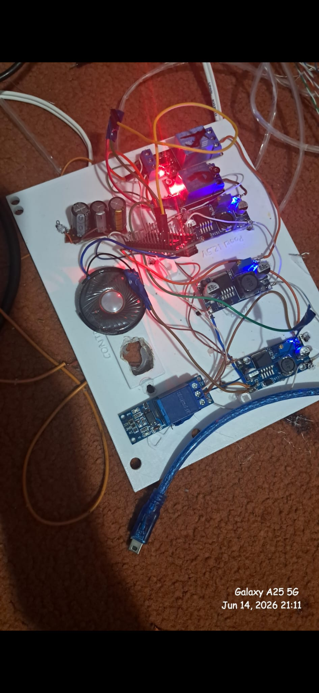

# 📺 Samsung TV Power Board Bypass System (UE46EH5300W)

Select your language / Dilinizi seçin:
- [English (#english)](#english)
- [Türkçe (#türkçe)](#türkçe)

---

## English

### 📝 Project Overview
This project is designed to bypass a burnt/malfunctioning power board on a Samsung UE46EH5300W television. By using an Arduino Nano, relay modules, and step-down converters, the TV can operate fully without its original power supply unit. While this specific setup is tailored for the UE46EH5300W model, it can be adapted to other TV models with necessary modifications.

### ⚙️ Required Components
- 1x Arduino Nano (Clone or original)
- 1x IRLZ44N Mosfet (Logic-level, N-Channel)
- 1x BC547 Transistor (NPN)
- 3x 5V Relay Modules (Triggered by 5V or GND)
- 4x LM2596 Step-Down (Buck) Converters
- 1x 5V Buzzer (or a simple headphone speaker for clearer sound)
- Resistors: 2x 10kΩ, 1x 330Ω, 1x 1kΩ
- Capacitors (Electrolytic): 1000uF (10V, 20V, and 25V ratings)
- Wires (Minimum 0.4mm thickness)
- Soldering iron, solder, flux
- Copper prototype board (Optional)

### 🛠️ Build Guide & System Architecture

#### 1. Backlight PWM Circuit
The original TV has 8 LED bars connected in series (6x 3V LEDs each), requiring 144V. To drive this via standard PWM without extra expensive drivers, I rewired the LED bars from series to parallel. 
- The operating voltage dropped to 18V. 
- A 19V input is stepped down to 18V via an LM2596.
- The positive output goes directly to the LEDs, while the GND goes to the Source pin of an **IRLZ44N logic-level mosfet**. 
- The motherboard's PWM signal connects to the Gate via a 330Ω resistor. A 10kΩ pull-up resistor is added between the Gate and Source to prevent unstable behavior when unpowered.

#### 2. Switching and Power Distribution
The TV requires an opening hierarchy: Standby (5.1V), SoC (5.1V), Panel (12.5V), and Vamp (11.8V).
- The 5.1V Standby is continuously fed from an LM2596 module.
- SoC, Panel, and Vamp lines are routed through the Normally Open (NO) terminals of 3 separate relays.
- **Crucial Fix:** To prevent the system from entering a bootloop due to module noise and voltage spikes, filter capacitors are wired in parallel to each line (1000uF 10V for SoC, 1000uF 20V for Panel, and 1000uF 25V for the 19V main input).

#### 3. Arduino Integration
- Powered via the VIN and GND pins directly from the 5.1V Standby LM2596 output.
- Relay triggers: SoC (D2), Vamp (D3), Panel (D4).
- Warning Buzzer: Connected to D8.

#### 4. Motherboard Communication (Logic Level Inverter)
The motherboard sends 3.3V signals, which the Nano cannot reliably read as HIGH. I built a simple logic level inverter using a **BC547 transistor**.
- Emitter goes to common GND.
- Motherboard signal goes to the Base via a 330Ω resistor.
- Collector connects to a 10kΩ pull-up resistor (tied to 5V) and the Nano's **A0 pin**.
- Result: 3.3V from the board = LOW at A0. 0V from the board = HIGH at A0.

#### 5. Operational Hierarchy (The Code Logic)
1. TV gets Standby voltage, status LED turns on.
2. User presses the power button.
3. Motherboard sends 3.3V -> Arduino reads LOW -> Turns on SoC Relay.
4. Motherboard drops signal to 0V for a 1-2 second self-check.
5. If okay, motherboard sends 3.3V again -> Arduino turns on Vamp and Panel relays.
6. If the signal drops unexpectedly (hardware failure), Arduino locks the system and triggers the alarm buzzer.

### ⚠️ Important Warnings
- **Wire Gauge:** The wires in the schematics are representations. Use appropriately thick wires for power lines in real life.
- **Insulation:** Never leave circuits exposed. Ensure proper insulation.
- **Compatibility:** This is a plug-and-play solution *only* for the UE46EH5300W. Using it on other TVs without modifying voltages and logic could result in permanent damage or fire.
- **Safety First:** Always take proper safety precautions when working with electronics.

### 💻 About the Code
Check the `tv_bypass_control.ino` file for detailed comments. **Note:** Make sure to adjust the `#define` section in the code depending on whether your relays are HIGH-level or LOW-level triggered.

## 📸 Schematic and System Overview

| Circuit Schematic | Final System Setup |
| :--- | | :--- |
|   |  | 

## 🎥 Project Test Video
You can watch the system boot-up sequence and stability test by clicking the image below:

  <a href="https://www.youtube.com/watch?v=weZp5X6VFU0">
    
     
    <b>▶ Click to Watch the Full Test Video</b>
  </a>

---

## Türkçe

### 📝 Projenin Amacı
Bu proje, yanan veya arızalanan bir Samsung UE46EH5300W televizyon güç kartını (power board) bypass etmek için geliştirilmiştir. Arduino Nano, röle modülleri ve voltaj düşürücüler sayesinde televizyon, orijinal güç kartı olmadan tam fonksiyonel olarak çalışabilmektedir. Proje UE46EH5300W modeli için tasarlanmış olsa da, gerekli modifikasyonlar yapılarak farklı TV modellerine de uyarlanabilir.

### ⚙️ Gereken Parçalar
- 1 Adet Arduino Nano (Klon veya Orijinal)
- 1 Adet IRLZ44N Mosfet (Logic-Level, N Kanal)
- 1 Adet BC547 Transistör (NPN)
- 3 Adet 5V (GND veya 5V tetiklemeli) Röle Modülü
- 4 Adet LM2596 Voltaj Düşürücü (Buck Converter)
- 1 Adet 5V Buzzer (veya temiz ses için kulaklık hoparlörü)
- Dirençler: 2 Adet 10kΩ, 1 Adet 330Ω, 1 Adet 1kΩ
- Kondansatörler (Elektrolitik): 1000uF (10V, 20V ve 25V)
- Kablolar (En az 0.4mm kalınlığında)
- Havya, Lehim, Flux vb.
- Bakır Plaket (İsteğe Bağlı)

### 🛠️ Projenin Yapılışı ve Sistem Mimarisi

#### 1. Backlight (Arka Işık) PWM Devresi
Cihazda seri bağlı 8 adet LED bar (her birinde 3V x 6 LED) bulunur ve normalde 144V ile çalışır. Bu yüksek voltajı standart mosfetlerle sürmek zor olduğundan LED barları seriden paralele çevirdim.
- Çalışma voltajı 18V'a düşürüldü.
- Ana girişten alınan 19V, LM2596 ile 18V'a çevrildi ve doğrudan LED paketinin artı (+) hattına bağlandı.
- LED'lerin GND hattı, **IRLZ44N logic-level mosfetin** Source bacağına bağlandı.
- Anakarttan gelen PWM sinyali, 330Ω direnç ile mosfetin Gate bacağına bağlandı. Elektrik yokken kararsız çalışmayı önlemek için Gate ile Source arasına 10kΩ pull-up direnci eklendi.

#### 2. Anahtarlama ve Güç Dağıtımı
Televizyonun açılma hiyerarşisi vardır: Stand-by (5.1V), SoC (5.1V), Panel (12.5V) ve Vamp (11.8V).
- 5.1V Stand-by voltajı sürekli olarak LM2596'dan sağlanır.
- SoC, Panel ve Vamp hatları 3 ayrı rölenin açık devre (NO) kısımlarına bağlandı.
- **Önemli Çözüm (Bootloop Sorunu):** Modüllerin gürültüsü ve voltaj dalgalanması cihazı bootloop'a (sürekli yeniden başlama) sokuyordu. Bunu çözmek için her hatta paralel filtre kondansatörü eklendi (SoC için 1000uF 10V, Panel için 1000uF 20V, Ana 19V giriş için 1000uF 25V).

#### 3. Arduino'nun Sisteme Dahil Edilmesi
- Güç, 5.1V Stand-by sağlayan LM2596'dan Arduino'nun VIN ve GND pinlerine bağlandı.
- Röle tetikleri: SoC (D2), Vamp (D3), Panel (D4).
- Alarm Buzzer'ı: D8 pinine bağlandı.

#### 4. Anakart ile Haberleşme (Logic Level Inverter)
Anakart 3.3V sinyal gönderir fakat Arduino Nano bunu her zaman HIGH olarak algılamayabilir. Bu yüzden **BC547 transistör** ile basit bir sinyal dönüştürücü devre kuruldu.
- Emiter bacağı ortak şaseye (GND) bağlandı.
- Anakarttan gelen sinyal, 330Ω direnç ile Base bacağına bağlandı.
- Collector bacağına 5V'a bağlı bir 10kΩ pull-up direnci eklendi ve bu nokta Arduino'nun **A0 pinine** bağlandı.
- Sonuç: Anakart 3.3V gönderdiğinde Arduino LOW algılar. Sinyal kesildiğinde (0V) HIGH algılar.

#### 5. Sistemin Çalışma Hiyerarşisi (Kod Mantığı)
1. Anakart Stand-by voltajını alır, durum ledi yanar.
2. Kumandadan açma tuşuna basılır.
3. Anakart 3.3V gönderir -> Arduino LOW algılar -> SoC rölesini açar.
4. Anakart sinyali 0V'a çeker, 1-2 saniye kendini test eder.
5. Her şey yolundaysa tekrar 3.3V gönderir -> Arduino Vamp ve Panel rölelerini açar.
6. Anakartta bir sorun olursa ve sinyal kesilirse, Arduino bunu fark edip sistemi kilitler ve alarm (buzzer) çalar.

### ⚠️ Önemli Tavsiyeler ve Uyarılar
- **Kablo Seçimi:** Şematik çizimlerdeki kablolar temsilidir. Gerçekte özellikle güç hatları için kalın ve uygun kablolar kullanın.
- **İzolasyon:** Devreleri kesinlikle açıkta bırakmayın, kısa devrelere karşı yalıtım sağlayın.
- **Uyum:** Bu sistem spesifik olarak UE46EH5300W için "tak-çalıştır" mantığındadır. Diğer modellerde voltaj ve hiyerarşi değerlerini modifiye etmeden kullanmak televizyonu yakma riski taşır.
- **Güvenlik:** Lütfen sistemi kurarken uygun güvenlik önlemlerini (elektrik çarpması vb.) alın.

### 💻 Kod Hakkında
`tv_bypass_control.ino` dosyası içinde gerekli tüm satır içi açıklamaları (`//...`) yaptım. **Uyarı:** Kullanacağınız rölelerin tetikleme türüne (LOW veya HIGH level trigger) göre koddaki `#define` kısımlarını kendi sisteminize göre düzenlemeyi unutmayın.

### 📸 Devre Şeması ve Sistem Görünümü
Aşağıda projenin detaylı şematik çizimi ve sistemin son montaj hali yer almaktadır:

| Devre Şeması | Sistemin Son Hali |
| :--- | :--- |
|  |  |

## 🎥 Proje Test Videosu
Aşağıdaki resme tıklayarak sistemin açılış sekansını ve kararlılık testini izleyebilirsiniz:

  <a href="https://www.youtube.com/watch?v=weZp5X6VFU0">
    
     
    <b>▶ Test Videosunu İzlemek İçin Tıklayın</b>
  </a>

